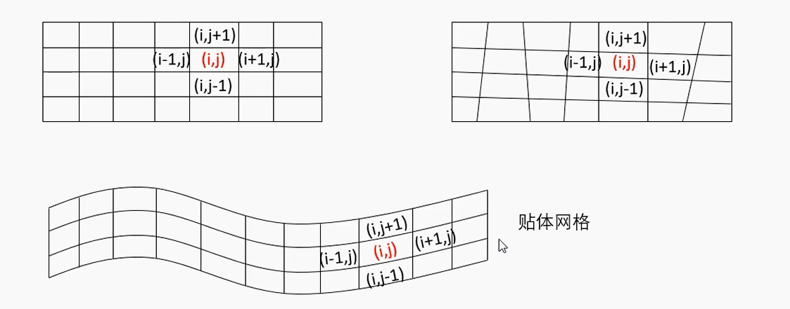
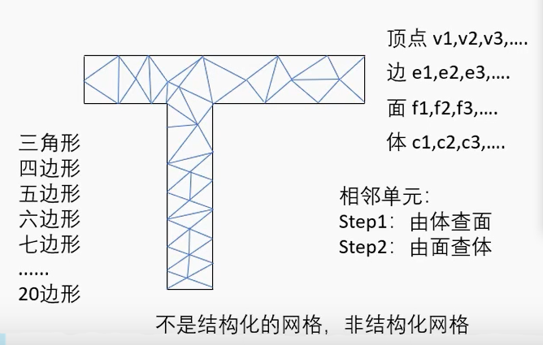

# 网格存储类型

## 结构化网格

结构化网格的特性: **已知网格内某个点, 其相邻的点都可以通过这个点的坐标计算得出**

- 网格区域内所有的内部点都具有相同的毗邻单元, 二维为四边形, 三维为六面体
- 在拓扑结构上矩形区域内的均匀网格，其节点定义在每一层的网格线上，且每一层上节点数都相等
- 可以生成贴体网格, 但复杂外形的贴体网格生产很困难, 例如圆形网格。

优点：

- 在结构化网格中，每一个节点及控制容积的几何信息必须加以存储，但该节点的邻点关系则是可以依据网格编号的规律而自动得出的，因此数据结构简单，不必专门存储这类信息；
- 网格生成的速度快, 网格生成的质量好；
- 对曲面或空间的拟合大多数采用参数化或样条插值的方法得到，区域光滑，与实际的模型更容易接近。它可以很容易地实现区域的边界拟合，适于流体和表面应力集中等方面的计算。

缺点

- 适用的范围比较窄，只适用于形状规则的图形, 画起来复杂

## 非结构化网格

非结构化网格是指网格区域内的内部点不具有相同的毗邻单元，可以是多种形状，四面体（也就三角的形状），六面体，棱形，也可以是六面体。与网格剖分区域内的不同内点相连的网格数目不同。

由点描绘边, 由边描绘面, 由面描述体. 原则上可以是各种图形, 但在描述复杂图形时候也可能存在离散误差, 例如用三角形组成一个多边形去描述一个圆。

优点

非结构画网格没有规则的拓扑结构，也没有层的概念。网格节点的分布是随意的，因此具有灵活性，用于复杂图形的描述

缺点：

计算时需要较大的内存, 在查找和存储相邻化网格时比较复杂, 除了点迭代以外, 结构化网格的算法基本都不适用。

## 分块结构化网格

将复杂的图形拆分成多个块, 然后在不同的块里面使用结构化网格. 这这种块与块之间的关系就叫做网格的拓扑结构. 

- 这种网格也是非结构化网格, 每个块之间的拓扑结构也需要描述
- 针对类似的图形, 分块情况可以继承, 达到网格可重用

优点: 继承了结构化网格的算法, 而且计算速度快

缺点: 分块基本都是是手动完成, 比较麻烦.

