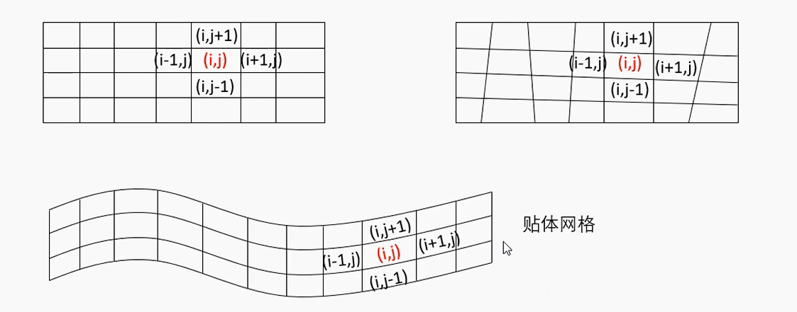
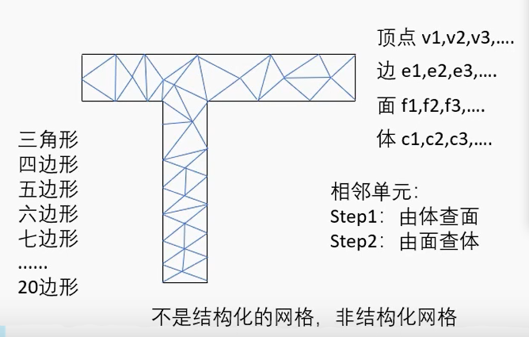

# 网格类型

## 网格类型

```shell
网格分类
|--结构网格
|     |--单块网格
|	  | 	|--O型网格
|	  |		|--C型网格
|	  |		└--H型网格
|	  └--多块网格
|	  		|--one-to-one
|			|--patched
|			└--overlapping/chimera
|--非结构网格
└--混合型网格
```


## 结构化网格

结构化网格的特性: **已知网格内某个点, 其相邻的点都可以通过这个点的坐标计算得出**

- 网格区域内所有的内部点都具有相同的毗邻单元, 二维为四边形, 三维为六面体
- 在拓扑结构上矩形区域内的均匀网格，其节点定义在每一层的网格线上，且每一层上节点数都相等
- 可以生成贴体网格, 但复杂外形的贴体网格生产很困难, 例如圆形网格。




**优点：**

- 在结构化网格中，每一个节点及控制容积的几何信息必须加以存储，但该节点的邻点关系则是可以依据网格编号的规律而自动得出的，因此数据结构简单，不必专门存储这类信息；
- 网格生成的速度快, 网格生成的质量好；
- 对曲面或空间的拟合大多数采用参数化或样条插值的方法得到，区域光滑，与实际的模型更容易接近。它可以很容易地实现区域的边界拟合，适于流体和表面应力集中等方面的计算。
- 由于结构网格可以很容易生成长宽比很大的黏性网格，计算时也基本可以保证要求的精度，因此，可以精确、高效地模拟边界层等黏性区域

**缺点**

- 适用的范围比较窄，只适用于形状规则的图形, 画起来复杂
- 目前，对于航空航天飞行器等复杂构型的流动问题，结构网格一般采用分区网格、重叠网格技术等方法克服其几何适应能力差的缺陷，但这又会带来分区网格各区间隐式边界条件难以实现、重叠网格各区间寻找变量传递对应点及变量插值不守恒性等一系列问题。


## 非结构化网格

非结构化网格是指网格区域内的内部点不具有相同的毗邻单元，可以是多种形状，四面体（也就三角的形状），六面体，棱形，也可以是六面体。与网格剖分区域内的不同内点相连的网格数目不同。

由点描绘边, 由边描绘面, 由面描述体. 原则上可以是各种图形, 但在描述复杂图形时候也可能存在离散误差, 例如用三角形组成一个多边形去描述一个圆。



**优点**:

- 非结构画网格没有规则的拓扑结构，也没有层的概念。网格节点的分布是随意的，因此具有灵活性，用于复杂图形的描述
- 非结构网格由于消除了结构网格中节点的结构性限制，节点和单元的分布可控性好，因而能较好地处理边界，容易控制网格的大小和节点的密度，它采用随机的数据结构有利于进行网格自适应以提高对间断（如激波等）的分辨率。
- 一旦在边界上指定网格的分布，在边界之间可以自动生成网格，无需分块分区或用户的干预，总能生成**整体网格、整体求解**，而且不需要在子域之间传递信息，不存在像结构网格分区嵌套需要插值而损失精度。
- 由于它随机的数据结构，使基于非结构网格的**网格分区**以及**并行计算**比结构网格要更加直接。

**缺点：**

- 计算时需要较大的内存, 在查找和存储相邻化网格时比较复杂, 除了点迭代以外, 结构化网格的算法基本都不适用。
- 非结构网格的无序性使其很难像结构网格那样保证矩阵的对角占优、推进计算时邻近网格是最新修正后的流动变量，因而对于收敛性也有较大影响
- 在同样的物理空间单元，非结构网格需要的网格点数比结构网格要多（一个结构网格的长方体可以划分为2～5个非结构网格的四面体），尤其在黏性区里，非结构网格很难使用类似与结构网格的大长宽比网格，这就导致了在黏性区里必须在各个方向都布置很密的网格，对于三维高Re数流动问题，其计算量超过了目前的计算机水平。
- CFD计算方法都是基于**各类波有向传输**的基本原理构造的，而非结构网格的随机方向性不易捕捉正确的流动结构，这将导致计算精度降低及计算稳定性下降。


## 分块结构化网格(混合型网格)

将复杂的图形拆分成多个块, 然后在不同的块里面使用结构化网格. 这这种块与块之间的关系就叫做网格的拓扑结构. 

- 这种网格也是非结构化网格, 每个块之间的拓扑结构也需要描述
- 针对类似的图形, 分块情况可以继承, 达到网格可重用

**优点:** 

- 继承了结构化网格的算法, 而且计算速度快

**缺点:** 

- 分块基本都是是手动完成, 比较麻烦.

**例子:** 在物面附近的黏性作用区采用结构化网格、其他区域采用普通四面体网格的混合网格技术：先对多体问题的每一单体或复杂单体问题的每一子块生成贴体结构网格，而在体与体、块与块之间的交界区挖出一个洞，该洞由非结构网格来填充，实现相邻两网格间的通量守恒


## 重叠网格

将复杂的流动区域分成多个几何边界比较简单的子区域，各子区域中的计算网格独立生成，彼此存在着重叠、嵌套或覆盖关系，流场信息通过插值在重叠区边界进行匹配和耦合。网格的重叠过程就是网格间插值关系的建立过程，是重叠网格技术的核心。

下面将从挖洞、寻点及壁面重叠三个方面阐述重叠网格进展。

1、挖洞

若某重叠网格单元落入另一网格域的非可透面（如物面、对称面或人工指定的挖洞曲面）内，则应被标记“洞内点”，不参与流场的计算。这一过程被形象地称之为“挖洞”。挖洞的结果产生了紧密围绕在洞内点周围的洞边界面，用于插值传递不同区域流场解的信息，隶属于插值边界面。因此，挖洞的过程的数学实质等价于解决一个所谓“点与封闭曲面的相对位置关系”问题。
关于挖洞方法的研究，主要是如何提高挖洞过程的可靠性、效率和自动化程度。Steger 等主要利用网格曲面法向矢量与网格点相对位置矢量的点积结果判断网格点与曲面的关系。这种方法在存在内凹的挖洞曲面时容易出错，并且挖洞的效率与被测试的网格点数、决定挖洞曲面的点数成正比。因此，随后出现了各种改型方法，如将挖洞曲面进行分解，使得每个曲面都呈凸特性；用解析的组合外形，如球体、圆柱、长方体等简单几何外形的组合体，来代替网格面作为挖洞曲面。

射线求交方法通过求从点P出发的任意射线与封闭的挖洞曲面交点的个数判断点P的位置，若射线与曲面相交奇数次则该点在挖洞面内部，若相交偶数次则该点在曲面外部。该方法涉及求交运算，因此运算量比较大，但可以采用ADT树 (alternating digital tree) 提高挖洞效率。

Chiu 和Meakin 提出洞映射 (hole-map) 方法，该方法将挖洞曲面投射到辅助的直角笛卡儿网格中，从而得到由笛卡儿网格构成的近似挖洞面，并根据相对位置的不同将笛卡儿网格单元分为“洞内单元”、“洞外单元”和“边缘单元”，从而将点与曲面之间的关系转化为点与洞映射单元之间的简单关系。洞映射方法的效率和自动化程度都很高，并且对内存的需求很低，从而得到广泛的应用，如Pegasus 5程序。

Object X-ray method 是对hole-map 方法的改进，它通过建立挖洞曲面在坐标轴方向投影的二维笛卡儿网格取代hole-map 方法的三维笛卡儿网格。在二维笛卡儿网格中找到点的投影，与射线求交方法类似，获得投影点沿坐标轴方向的射线与挖洞面的相交的交点的个数，从而判断点为洞内点或者洞外点。该方法与hole-map方法相比具有更高的挖洞效率。

2、寻点

寻点所要解决的问题可以简化为：己知一物理空间点P 的坐标 (xp, yp, zp)，求网格中能包围该点的网格单元的逻辑坐标 (i, j, k)。对于结构网格而言，即在离散空间中寻找一个六面体单元来包围一给定点的问题。寻点效率的高低及准确与否对整个重叠网格方法有很大的影响，有时甚至是重叠网格方法成败的关键。

一般将寻点过程分为两步：先寻找距离空间点最近的网格单元，然后在其附近寻找合适的网格单元将空间点包围住。

首先，采用好的数据结构，如二叉树、四叉树、八叉树、ADT树等结构的应用，找到距离空间点最近的可能的贡献单元的集合；

其次，利用点和贡献单元相对位置的几何判断方法在可能的贡献单元中寻找空间点的正确贡献单元，如通过位置矢量的点积运算判断网格点与贡献单元的关系；

最后，采用三线性插值的方法求解空间点的插值系数，若系数在 [0, 1] 则该空间点找到合理的贡献单元；若系数在 [0, 1] 范围之外，则以该贡献单元为初始单元采用stencil walk 方法做进一步搜索以找到合理的贡献单元。

3、壁面重叠技术

若物面结构非常复杂，无法实现空间拓扑，则希望在物面网格重叠的基础上取消空间网格的拓扑限制，从而减轻空间网格生成的难度。在重叠网格的生成过程中，各子网格可以独立生成而不必考虑其他网格的存在，若对物面网格进行分块再独立生成，则有可能因为各部分的网格在几何误差、曲面曲率分辨率和光滑程度等因素上的不同，重叠区内彼此描述的物面不唯一，即所谓的“物面失配”问题。

为了提高效率，范晶晶等先对每个物体的所有固壁建立壁面的ADT树，通过ADT树查找壁面插值点可能存在的贡献单元，然后再对可能的贡献单元用stencil walk 方法做进一步的判断，在判断中保持壁面法向恒定。用三线性插值求出x，y，z三个方向的插值系数*ε*，*η*，*ξ*，其中与壁面法向同方向的插值系数表示插值点到贡献单元包含壁面的距离，令该插值系数值等于零，以保证壁面插值点是从贡献单元的壁面4个点插值的，这样相当于将壁面插值点投影到贡献单元的壁面上，而插值点法向上的点均向壁面移动一定的距离，该距离等于壁面插值点投影的距离即与壁面法向同方向的插值系数值，从而保证壁面插值点及该插值点法向上插值点的合理插值单元。该方法只针对壁面上的插值点及插值点所在的法向上的网格进行操作，并在挖洞和寻点过程结束后对壁面的插值点进行系数的修正，方法简单，因为采用了ADT树结构，所以效率很高。